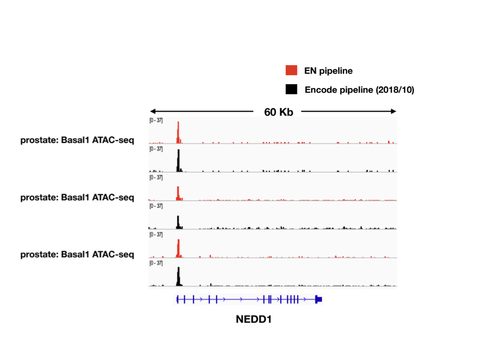
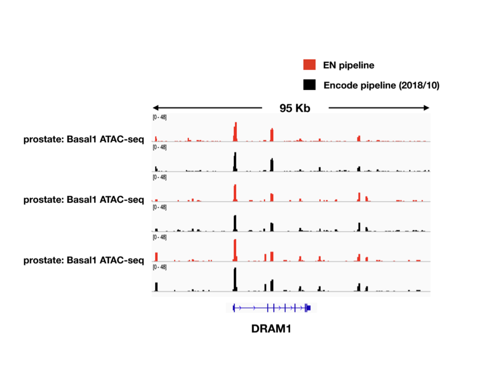

# ATAC-Seq-pipeline-based-on-Encode
__Writen by Chunlei Yu__
 

## Introduction
 
Introduction
This EN ATAC-seq data processing pipeline is based on the latest version of  ENCODE ATAC-pipeline processing pipeline (v1.4.2)(https://www.encodeproject.org/atac-seq/). The pipeline supports single-end or paired-end ATAC-seq (with or without replicates). The pipeline produces formatted HTML reports that include quality control measures specifically designed for ATAC-seq, analysis of reproducibility, stringent and relaxed thresholding of peaks, fold-enrichment and pvalue signal tracks. The pipeline has been tested on human ATAC-seq data(GEO accession number: GSE118204).
The performance of EN ATAC-Seq is the same with latest Encode pipeline (Red Arrow).
 

